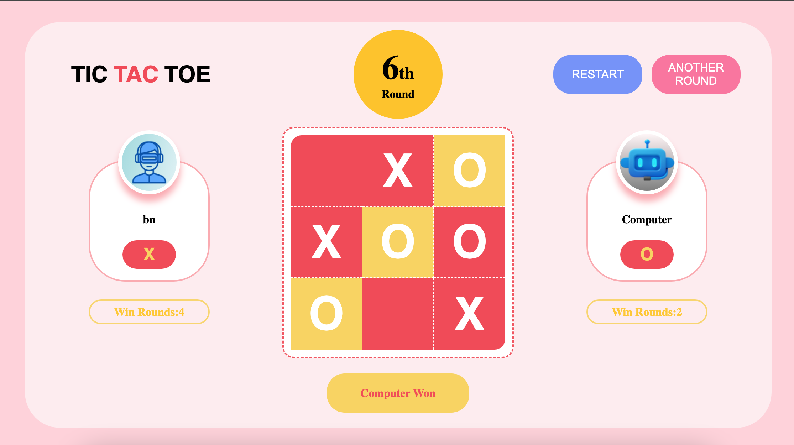

# Tic Tac Toe

## Preview

## Introduction

This repository contains a simple implementation of the classic Tic Tac Toe game built using HTML, CSS, and JavaScript, as part of [The Odin Project](https://www.theodinproject.com/lessons/node-path-javascript-tic-tac-toe/)'s curriculum. The game allows players to play against each other or against the computer.

## How to Play

To play the game, follow these steps:

1. Clone the repository to your local machine.
2. Open the `index.html` file in your preferred web browser.
3. Enter your name and select your symbol (X or O) to start the game.
4. Click on the Tic Tac Toe grid to make your move.
5. The game will alternate between player and computer turns.
6. The first player to achieve a winning pattern (horizontal, vertical, or diagonal) or fill the entire board without a winner will be declared the winner.

## Features

- Player setup modal: Allows users to enter their name and select their symbol before starting the game.
- Player vs. Computer mode: Play against an AI-controlled opponent.
- Visual indication of winning cells: Highlight the cells that form the winning pattern.
- Round tracking: Keep track of the current round and display it on the interface.
- Score tracking: Keep track of each player's score throughout multiple rounds.

## Technologies Used

- HTML
- CSS
- JavaScript

## Prerequisites

You need a modern web browser that supports HTML and CSS.

## Installation

Clone this repository to your local machine or download the ZIP file and extract it to a local folder. Open the index.html file in your web browser.

## Credits

This project is created by [Jathusan08](https://github.com/Jathusan08). If you have any questions or suggestions, feel free to open an issue.

## License

This project is licensed under the [MIT License](LICENSE). Feel free to use, modify, and distribute the code.
